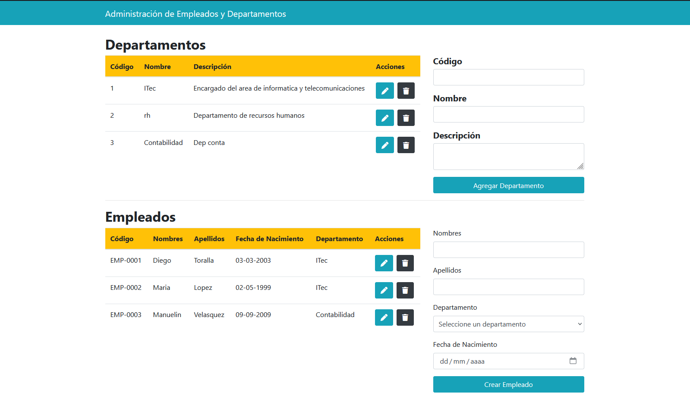

# Aplicación de Gestión de Empleados y Departamentos

Este proyecto es una aplicación web para la gestión de empleados y departamentos. Permite realizar operaciones CRUD (Crear, Leer, Actualizar, Eliminar) sobre empleados y departamentos, así como asignar empleados a diferentes departamentos.

## Requisitos Previos

Tener instalado lo siguiente:
- Node.js (versión 12.x o superior)
- npm (incluido con Node.js)
- MySQL (versión 5.7 o superior)

## Configuración del Proyecto

### Clonar el Repositorio

Para obtener el proyecto, clona este repositorio en tu máquina local usando:

```bash
git clone https://github.com/jd-toralla/servir-app
cd servir-app
```

## Instalar Dependencias

Dentro del directorio del proyecto, ejecuta el siguiente comando para instalar las dependencias necesarias tanto para el server como para el cliente:

``` bash
    npm install
```

## Configuración de la Base de Datos

Configurar las variables de entorno necesarias para la conexión a la base de datos en un archivo .env en la raíz del proyecto, en la carpeta server:

``` bash
DB_HOST=localhost
DB_USER=usuario
DB_PASSWORD=contraseña
DB_NAME=sirve

PORT=5000
```

## Ejecutar el Servidor en NodeJs

Para iniciar el servidor, ejecutar:

``` bash
npm start
```

Esto iniciará el servidor en http://localhost:5000 por defecto.

## Ejecutar la Aplicación en React

Para iniciar el cliente, ejecutar:

``` bash
npm start
```

Acceder a http://localhost:3000 desde el navegador para interactuar con la interfaz de la aplicación.

Utilizar las interfaces proporcionadas para agregar, editar, eliminar y ver empleados y departamentos.




